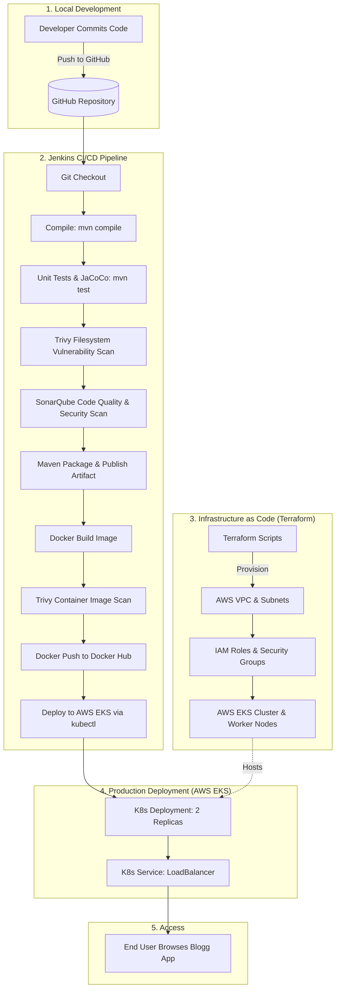

# 📝 Blogg App - Full-Stack Spring Boot & DevSecOps Cloud Pipeline


---

## 📌 Project Overview

**Blogg App** (also referenced as **Twitter App**) is an enterprise-ready, full-stack Spring Boot web application featuring user authentication, post creation, and blogging functionalities. Beyond the application code, this project presents a complete, end-to-end **DevSecOps & Cloud Native Architecture**—incorporating Automated Security Scanning (Trivy), Static Code Analysis (SonarQube), Code Coverage (JaCoCo), CI/CD Automation (Jenkins), Infrastructure as Code (Terraform), and Kubernetes Orchestration (AWS EKS).

---

## 🔄 End-to-End Project Flow



---

## ✨ Key Features

### 🌐 Web Application Features
* **User Authentication & Authorization**: Form-based authentication powered by Spring Security, custom `UserDetailsService`, and BCrypt password encoding.
* **Blogging & Posting**: Registered users can publish, view, and interact with posts via a dynamic UI.
* **Responsive Frontend**: UI rendered using Thymeleaf templates styled with modern HTML/CSS layout (`home.html`, `login.html`, `register.html`, `add.html`).
* **In-Memory Database & Management**: Integrated H2 database with the web console enabled at `/h2-console` for quick local testing and debugging.

### 🛡️ DevSecOps & Security Automation
* **Static Application Security Testing (SAST)**: SonarQube analysis integrated into the CI/CD pipeline for code quality gates and vulnerability identification.
* **Vulnerability Management**: Trivy file-system and container image vulnerability scans generate automated HTML reports (`fs.html`, `image.html`).
* **Code Coverage Analysis**: JaCoCo Maven plugin automatically produces coverage metrics during test execution.

### ☁️ Cloud Infrastructure & Deployment Automation
* **Infrastructure as Code (IaC)**: Terraform provisions AWS VPC, subnets, Internet Gateways, Security Groups, IAM Roles, and an EKS Cluster with managed node groups (`t2.large`).
* **Containerization**: Optimized Docker image based on `eclipse-temurin:17-jdk-alpine`.
* **Kubernetes Orchestration**: Kubernetes Deployment setup with 2 replicas, image pull secrets (`regcred`), and a LoadBalancer Service exposing port 80.
* **Automated CI/CD**: Fully automated Jenkins Declarative Pipeline (`Jenkinsfile`).

---

## 🛠️ Technology Stack & Tools

| Component | Technology / Tool | Description |
| :--- | :--- | :--- |
| **Backend Framework** | Java 17/21, Spring Boot 3.3.2 | Core application logic & MVC framework |
| **Persistence Layer** | Spring Data JPA, H2 Database | ORM and runtime in-memory database |
| **Security Layer** | Spring Security 6, Thymeleaf Extras | Authentication, RBAC, session management |
| **Frontend Templates**| Thymeleaf, HTML5, CSS3 | Dynamic server-side rendering |
| **Build & Dependencies**| Apache Maven (`mvnw`) | Build automation and dependency management |
| **CI/CD Engine** | Jenkins | Automated multi-stage build, test, and release |
| **Containerization** | Docker | Packaging application into lightweight containers |
| **IaC** | Terraform (v1.0+) | Provisioning AWS cloud infrastructure |
| **Cloud Provider** | AWS (EKS, EC2, VPC, IAM) | Cloud hosting environment |
| **Kubernetes** | `kubectl`, EKS Node Groups | Container orchestration |
| **Code Quality / Security**| SonarQube, JaCoCo, Trivy | SAST, coverage, and vulnerability scanning |

---

## 📁 Repository Structure

```
Blogg-App-main/
├── Dockerfile                   # Docker build instructions (JDK 17 Alpine)
├── Jenkinsfile                  # Multi-stage CI/CD Jenkins declarative pipeline
├── deployment-service.yml       # Kubernetes Deployment & LoadBalancer Service spec
├── pom.xml                      # Maven project configuration & dependencies
├── mvnw / mvnw.cmd              # Maven wrapper scripts
├── EKS_Terraform/               # Infrastructure as Code (Terraform)
│   ├── main.tf                  # AWS VPC, EKS Cluster, Node Groups, & IAM roles
│   ├── variables.tf             # Terraform variables (SSH key, region, etc.)
│   ├── output.tf                # Cluster outputs (VPC ID, Cluster ID, Subnets)
│   ├── serviceaccount.yml       # K8s Service Account definition
│   ├── serviceaccount-token.yml # K8s Secret token for Service Account
│   ├── role.yml                 # K8s RBAC Role definition
│   └── rolebinding.yml          # K8s RBAC Role Binding definition
└── src/                         # Application source code
    ├── main/
    │   ├── java/com/example/twitterapp/
    │   │   ├── TwitterAppApplication.java  # Main application entry point
    │   │   ├── config/                    # Spring Security & Custom UserDetails
    │   │   ├── controller/                # Web Controllers (UserController, PostController)
    │   │   ├── model/                     # JPA Entities (User, Post)
    │   │   └── service/                   # Business logic implementations
    │   └── resources/
    │       ├── application.properties     # App settings & H2 database configuration
    │       └── templates/                 # Thymeleaf views (home, login, register, add)
    └── test/                          # Unit and integration tests
```

---

## 📋 Prerequisites

Before running or deploying the project, ensure you have the following tools installed and configured:

* **Java Development Kit (JDK)**: Java 17 or higher
* **Apache Maven**: 3.8+ (or use included `./mvnw`)
* **Docker Desktop / Docker Engine**: 20.10+
* **Terraform**: 1.0+
* **AWS CLI**: Configured with valid credentials (`aws configure`)
* **kubectl**: Kubernetes CLI tool
* **Jenkins Server**: With Maven, JDK 21, Docker, and SonarQube plugins configured

---

## 🚀 Step-by-Step Setup Guide

### Option 1: Local Execution (Development Mode)

1. **Clone the repository**:
   ```bash
   git clone https://github.com/19bcs22Ravi/Blogg-App.git
   cd Blogg-App
   ```

2. **Build and test the application**:
   ```bash
   ./mvnw clean test
   ```

3. **Run the Spring Boot application**:
   ```bash
   ./mvnw spring-boot:run
   ```

4. **Access the application**:
   * **Web UI**: Open your browser and navigate to `http://localhost:8080`
   * **H2 Database Console**: Open `http://localhost:8080/h2-console`
     * **JDBC URL**: `jdbc:h2:mem:twitterapp`
     * **User**: `sa`
     * **Password**: `password`

---

### Option 2: Run with Docker

1. **Package the Spring Boot application JAR**:
   ```bash
   ./mvnw clean package -DskipTests
   ```

2. **Build the Docker container image**:
   ```bash
   docker build -t blogg-app:latest .
   ```

3. **Run the container**:
   ```bash
   docker run -d -p 8080:8080 --name blogg-app-container blogg-app:latest
   ```

4. **Verify container status**:
   ```bash
   docker logs -f blogg-app-container
   ```
   Access the web app at `http://localhost:8080`.

---

### Option 3: Provision AWS Infrastructure via Terraform

1. **Navigate to the Terraform directory**:
   ```bash
   cd EKS_Terraform
   ```

2. **Initialize Terraform**:
   ```bash
   terraform init
   ```

3. **Review the execution plan**:
   ```bash
   terraform plan
   ```

4. **Provision the AWS EKS Cluster & VPC**:
   ```bash
   terraform apply -auto-approve
   ```

5. **Update local Kubeconfig to connect to the new cluster**:
   ```bash
   aws eks update-kubeconfig --region ap-south-1 --name bloggapp-cluster
   ```

---

### Option 4: Deploy to Kubernetes Cluster (AWS EKS)

1. **Create the target namespace**:
   ```bash
   kubectl create namespace webapps
   ```

2. **Create Docker Hub Registry Secret for image pulling**:
   ```bash
   kubectl create secret docker-registry regcred \
     --docker-server=https://index.docker.io/v1/ \
     --docker-username=<your-dockerhub-username> \
     --docker-password=<your-dockerhub-password> \
     --docker-email=<your-email> \
     -n webapps
   ```

3. **Deploy the application and service**:
   ```bash
   kubectl apply -f deployment-service.yml -n webapps
   ```

4. **Verify Deployment & Services**:
   ```bash
   kubectl get pods -n webapps
   kubectl get svc -n webapps
   ```

5. **Obtain External IP / URL**:
   Look for the `EXTERNAL-IP` of `bloggingapp-ssvc` under `kubectl get svc -n webapps` to access the application via your cloud load balancer on port `80`.

---

### Option 5: Setting Up the Jenkins CI/CD Pipeline

To run the pipeline defined in `Jenkinsfile`:

1. **Configure Tools in Jenkins**:
   * **JDK**: Name `JDK-21`
   * **Maven**: Name `maven3`
   * **SonarQube Scanner**: Name `sonar-scanner`

2. **Configure Jenkins Credentials**:
   * `git-creds`: GitHub Username & Password / Token
   * `docker-creds`: Docker Hub Username & Password
   * `k8-creds`: Kubernetes Service Account / Kubeconfig credentials

3. **Configure SonarQube Server**:
   * Define SonarQube Server endpoint in **Manage Jenkins > System > SonarQube servers** named `sonar-server`.

4. **Create Pipeline Job**:
   * Create a new Pipeline project in Jenkins.
   * Under **Pipeline Definition**, select **Pipeline script from SCM**.
   * Choose **Git**, enter your repository URL, set branch to `main`, and set Script Path to `Jenkinsfile`.
   * Click **Build Now**.

---

## 🧪 Security & Quality Verification Commands

### 📊 Unit Tests & Coverage Report (JaCoCo)
```bash
./mvnw clean test
```
The coverage report is generated at `target/site/jacoco/index.html`.

### 🔍 Trivy Filesystem Scan
```bash
trivy fs --format table -o fs.html .
```

### 🐳 Trivy Docker Image Scan
```bash
trivy image --format table -o image.html ravi0919/blogg-app:latest
```

---

## 🤝 Contributing

1. Fork the repository
2. Create your feature branch (`git checkout -b feature/AmazingFeature`)
3. Commit your changes (`git commit -m 'Add some AmazingFeature'`)
4. Push to the branch (`git push origin feature/AmazingFeature`)
5. Open a Pull Request

---

## 📄 License

This project is licensed under the MIT License - see the `LICENSE` file for details.
